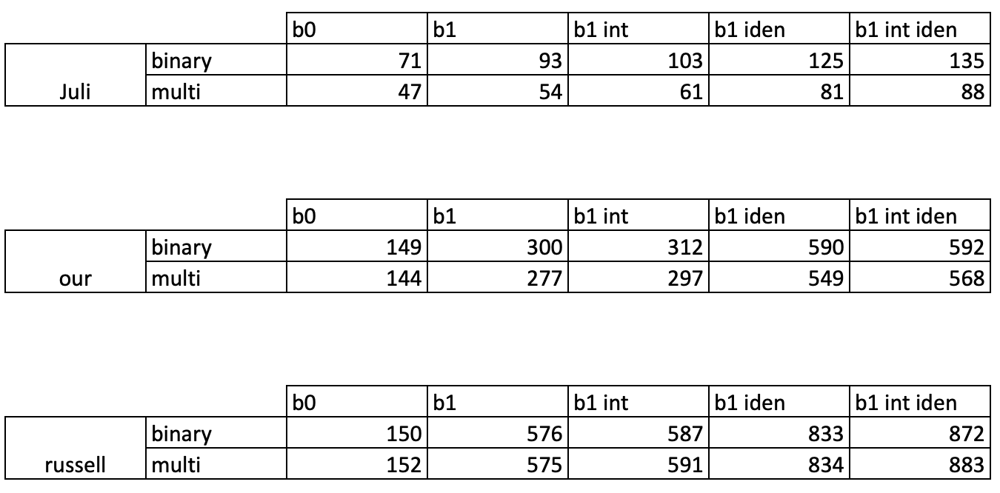

Here you can find the following scripts to train and tune hyper-parameters:

* **CNN_binary.py**  You can use this script to train and tune CNN models for binary classifciation for all the dataset and representations. 
* **RNN_binary.py**  You can use this script to train and tune RNN models for binary classifciation for all the dataset and representations. 
* **CNN_multi.py**  You can use this script to train and tune CNN models for binary classifciation for all the dataset and representations. 
* **RNN_multi.py**  You can use this script to train and tune CNN models for binary classifciation for all the dataset and representations. 
* **RF_BOW.py**  You can use this script to train and tune Random Forest models for binary and multi-classs classifciation for all the dataset and representations. 

For **CNN_binary.py**, **RNN_binary.py**, **CNN_multi.py**, **RNN_multi.py**, You have to change i)  the value of the variable **rep** that defines the representation that is being trained;ii)  **dataset** variable which describes the dataset that is being used for training the model; iii) **vocab** which represent the maximum length of the vocabulaary. In the following list we present the values that each variable can take:

**rep**
* b0 (which represents R0)
* b1 (which represents R1)
* b1_int (which represents R2)
* b1_iden (which represents R3)
* b1_int_iden (which represents R4)

***dataset*
* Juliet (which represents J-DS)
* OUR (which represents GH-DS)
* Russell (which represents R-DS)

**vocab**
Please refer to the following table (****vocab.csv****), in which you can find the maximum length of the vocabulary for each representation, dataset and approach.

